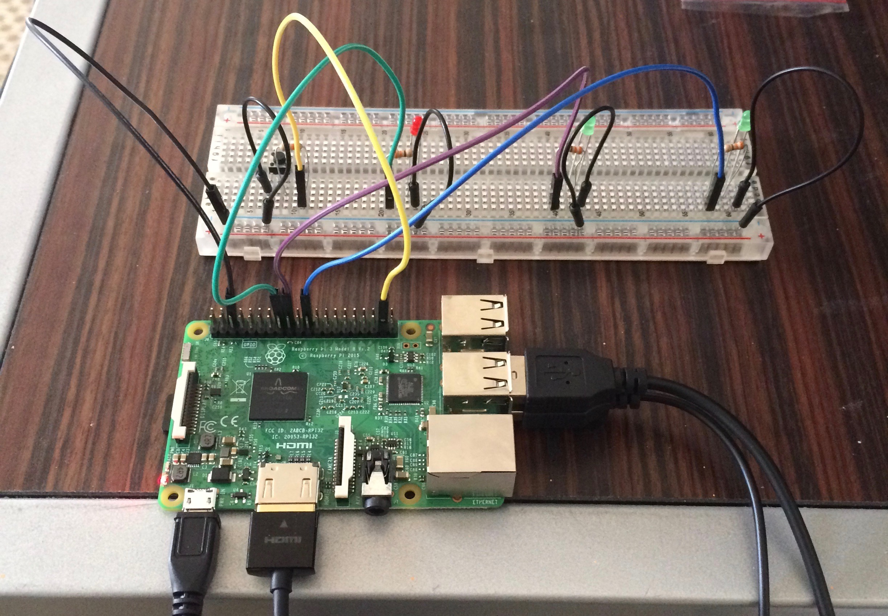
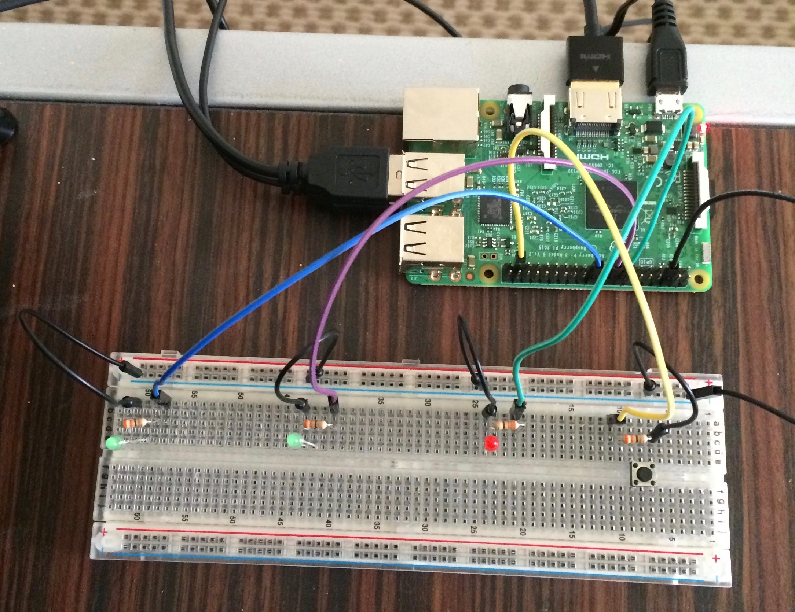
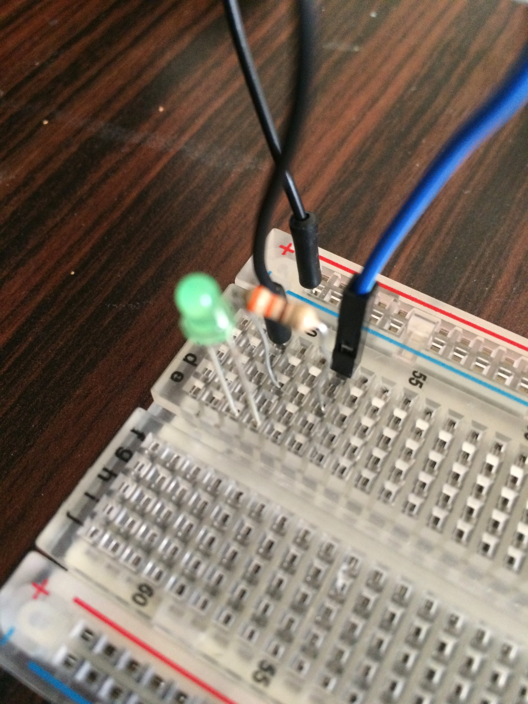
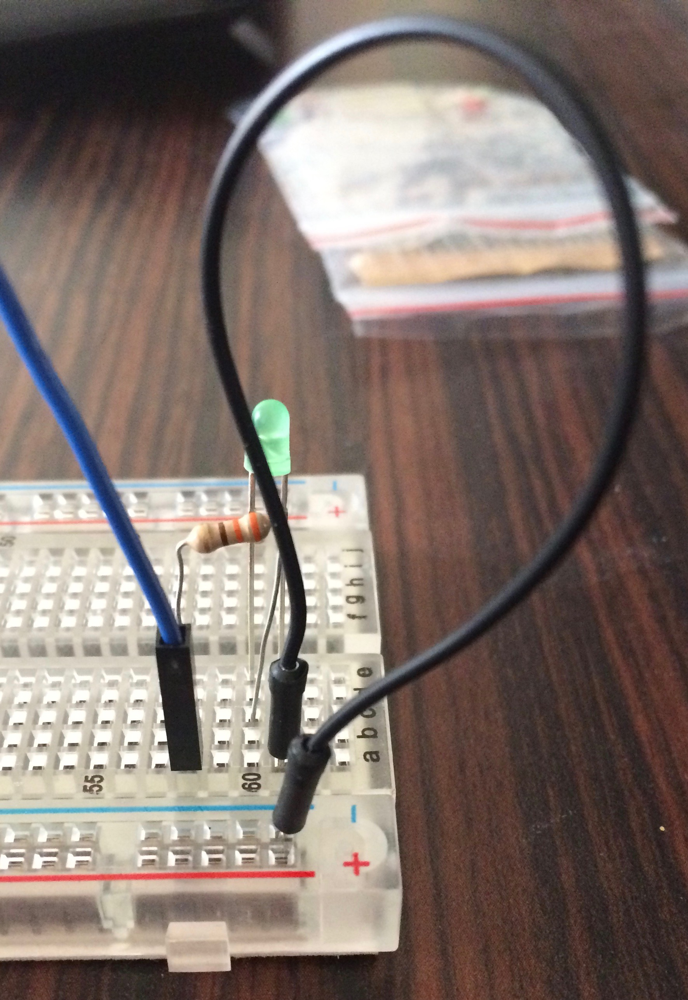
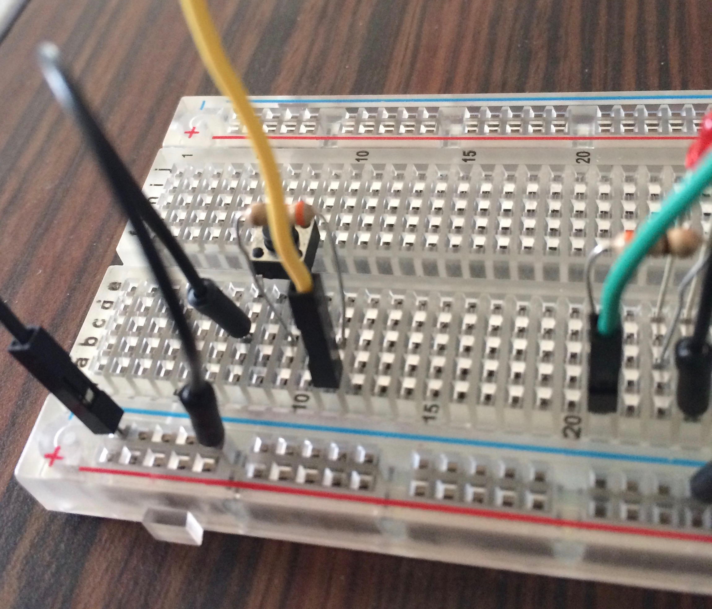
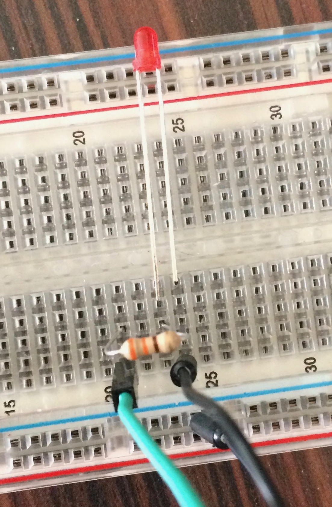

# Reflexes

Test your reflexes in this exciting Raspberry Pi game designed with the intention of teaching kids about computer science and engineering. Made for Engineering Day (E-Day) 2017-2018 at the University of Kentucky.

Once the program is run, the player enters their name and pressed the 'enter' key to start the game. The player must then wait for the third/red LED to light up to press the button as quick as they can. The average score is about .2. Getting less than that means that the player has great reflexes!

[Get started with your Raspberry Pi using this link](https://www.imore.com/how-get-started-using-raspberry-pi). You do not need an internet connection.

Once you've completed getting started with the Raspberry Pi, you can set up the physical aspect of this project.

What you'll need (in addition to the things from the link above):
- Breadboard
- 5 Male-to-Female jumper/DuPont wires
- 4 Female-to-Female jumper/DuPont wires
- 4 resistors
- 3 LED lights, preferably all being different colors or one being a different color from the other two
- Button

Program was originally created using the Raspberry Pi 3 Model B and Python 2.

